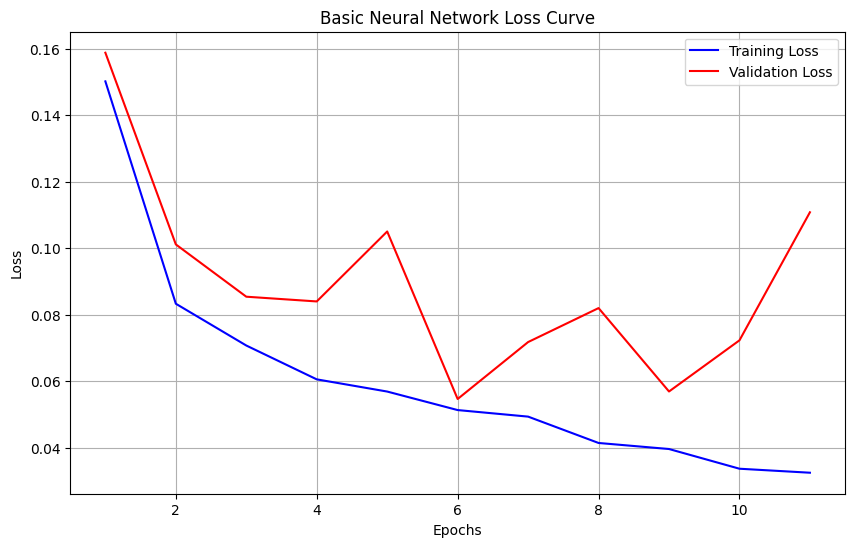

# 2024_ia653_Crow_Hove

# Introduction

In this project, we employ natural language processing (NLP) techniques to develop a machine learning model capable of classifying text as either AI-generated or human-written. 

With the rise of AI-generated content across various domains, identifying the origin of text is increasingly important for ensuring transparency, credibility, and authenticity in media, education, and digital communication. 

By analyzing linguistic patterns and textual features characteristic of AI and human authorship, our goal is to create a reliable predictive model that can distinguish between the two.

# Dataset Description

The dataset used in this project is the "Training_Essay_Data" dataset, sourced from [**Kaggle**](https://www.kaggle.com/datasets/sunilthite/llm-detect-ai-generated-text-dataset), comprising both AI-generated and human-written texts for binary classification and natural language processing tasks. This data was compiled from student-written essays and essays generated by a variety of Large Language Models (LLMs), resulting in high-quality data for distinguishing between human and AI-generated content.

This dataset includes approximately 29,000 entries, all of which are written in English about a variety of topics. 

The rows contain text data, with a binary label indicating the source of generation (1 for AI-generated, 0 for human-written). 

This label distribution shows that about **40%** of the entries are AI-generated, and the remaining **60%** are human-written, providing a balanced yet slightly human-skewed dataset.


Variables in the dataset:

- text: The content of the essay or text, with **27,340 unique entries.**
- generated: A binary label where **"1" signifies AI-generated text, and "0" represents human-written text.**

This dataset is formatted as a CSV file with a total size of 65.46 MB, suitable for large-scale natural language processing and machine learning applications.


## Datasheet

**Motivation**: Created to facilitate the detection of AI-generated text in academic and professional domains.

**Situation**: Texts include essays from educational contexts and outputs from LLMs under various prompts.

**Language Variety**: Primarily English, encompassing formal and semi-formal styles.

**Speaker Demographics**: Student authors and AI systems with diverse prompt configurations.

**Collection Process**: Data was ethically sourced and de-identified to ensure privacy. Metadata includes text and origin labels.

**Annotation Process**: The labels were programmatically assigned (AI vs. human) based on source.

**Distribution**: Free for academic and non-commercial use under the specified license.


# Project Goals

Our objective is to create a robust classifier capable of accurately distinguishing between AI-generated and human-written text. This model can potentially be used in:
- Academic integrity tools
- Content moderation systems
- Journalism and media transparency


# Process Overview

The project followed these key phases:
1. **Data Loading and Understanding**: Initial exploration of the dataset to understand its structure and distribution.
2. **EDA and Preprocessing**: Text cleaning, tokenization, and embedding generation.
3. **Model Selection and Fitting**: Trying out different ML and DL models.
4. **Evaluaiton**: Analyzing performance metrics to determine the best-performing model.
5. **Iterative Refinement**: Addressing overfitting.


# EDA/Preprocessing 

Our input was the text data of the raw essays, and our target variables were the generated binary label for the purpose of Binary Classification.

Before normalizing the text, we wanted to understand the dataset a bit more, so we found the word count and vocab size distributions to see if our data would fit with Heap's Law. As you can see in the figure below, its not a perfectly linear relationship but its pretty close.


### Text Normalization
The next step in our process was to normalize our text. We decided to use a lemmatizer after removing stop words and then tokenize the text into sentences. The functions we used to do this are below.

```{python}
def normalize_text(text):
    tokens = word_tokenize(text)
    stop_words = set(stopwords.words('english'))
    tokens = [word.lower() for word in tokens if word.isalpha() and word.lower() not in stop_words]
    tokens = [lemmatizer.lemmatize(word) for word in tokens]
    normalized_text = ' '.join(tokens)
    return normalized_text

def segment_sentences(text):
    sentences = sent_tokenize(text)
    return sentences
```

### N-Grams
The next thing we wanted to see were the different bigrams and trigrams between human and ai generated text. The Top 10 most common ones are shown in the figure below:


As you can see, most of the n-grams are similar but the ai ones are a little more formal than the human ones. 

### Embeddings
After tokenizing the text, we generated word embeddings using Word2Vec and identified the Top 10 words most similar to __*ai*__. The results emphasize __*ai*__'s strong connection to advanced concepts like automation, robotics, and predictive computing.

| Keyword        | Score      |
|----------------|------------|
| intelligence   | 0.717855  |
| sophisticated  | 0.656383  |
| robotic        | 0.653765  |
| automation     | 0.653423  |
| robotics       | 0.633817  |
| iot            | 0.627065  |
| artificial     | 0.615188  |
| sensor         | 0.579249  |
| predictive     | 0.576298  |
| computing      | 0.566514  |

We then wanted to visualize these embeddings so we decided to use Principal Compenent Analysis (PCA) to help us do that, which can be seen in the figure below.


We generated document-level vector representations by averaging Word2Vec embeddings for the tokens in each document. This approach captures the semantic meaning of the text, creating a feature matrix where each row represents a document as a vector in embedding space. These vectors were then used as input features for some of our training and evaluation models for our classification task.

# Model Selection and Fitting

We decided to try out four different models, Naive Bayes, Logistic Regression, a Basic Feedforward Neural Network, and an LSTM model. Since our dataset was slightly imbalanced, we decided to undersample the majority class (human generated). This balancing of the dataset occured for each model after the train-test split was created in order to ensure the test data was left untouched, so as to not create any bias.

### Naive Bayes
We used TF-IDF vectors as input features for the Naive Bayes model, because it is better suited for discrete and sparse representations. While Word2Vec embeddings can technically be used, they produce dense, continuous vectors that do not align well with the Naive Bayes assumption of feature independence. TF-IDF, with its interpretable and probabilistic nature, ensures better compatibility and performance for this model.

First, we transform the normalized_text column into a sparse matrix of TF-IDF features using TfidfVectorizer, limiting the number of features to 5000 for manageability. The data is then split into training and test sets, with the undersampling step applied to balance the classes. We train a MultinomialNB model on the balanced training data, fit it to the training set, and evaluate its performance on the test set.

```{python}
tfidf = TfidfVectorizer(max_features=5000)
X_tfidf = tfidf.fit_transform(data['normalized_text'])

X_train_tfidf, X_test_tfidf, y_train, y_test = train_test_split(X_tfidf, y, test_size=0.2, random_state=42)

undersampler = RandomUnderSampler(random_state=42)
X_train_balanced, y_train_balanced = undersampler.fit_resample(X_train_tfidf, y_train)

nb_model = MultinomialNB()
nb_model.fit(X_train_balanced, y_train_balanced)
```

### Logistic Regression
Our Logistic Regression model uses document vectors generated from Word2Vec embeddings as input features. We first split the data into training and test sets and apply undersampling to balance the classes. The balanced training data is used to fit the logistic regression model, which is trained with a maximum of 500 iterations to ensure convergence. The model's performance is then evaluated on the test set.

```{python}
X_train_docvec, X_test_docvec, y_train, y_test = train_test_split(X, y, test_size=0.2, random_state=42)

undersampler = RandomUnderSampler(random_state=42)
X_train_balanced, y_train_balanced = undersampler.fit_resample(X_train_docvec, y_train)

lr_model = LogisticRegression(max_iter=500)
lr_model.fit(X_train_balanced, y_train_balanced)
```

### Basic Neural Network

Our Basic Neural Network model utilizes document vectors generated from the Word2Vec embeddings as input features. We start by splitting the data into training and test sets and apply undersampling to balance the classes. 
The neural network architecture consists of an input layer, two hidden layers with ReLU activation functions and dropout layers for regularization, and an output layer with a sigmoid activation for binary classification. The model is compiled with the Adam optimizer and binary cross-entropy loss, and trained using early stopping to avoid overfitting. The performance of the model is evaluated on the test set.

```{python}
X_train, X_test, y_train, y_test = train_test_split(X, y, test_size=0.2, random_state=42)

undersampler = RandomUnderSampler(random_state=42)
X_train_balanced, y_train_balanced = undersampler.fit_resample(X_train, y_train)

model_basic = tf.keras.Sequential([
    tf.keras.layers.Dense(128, activation='relu', input_shape=(X.shape[1],)),
    tf.keras.layers.Dropout(0.3),
    tf.keras.layers.Dense(64, activation='relu'),
    tf.keras.layers.Dropout(0.3),
    tf.keras.layers.Dense(1, activation='sigmoid')
])

early_stopping = tf.keras.callbacks.EarlyStopping(
    monitor="val_accuracy", patience=5, restore_best_weights=True)

model_basic.compile(optimizer='adam', loss='binary_crossentropy', metrics=['accuracy'])

history_nn = model_basic.fit(X_train_balanced, y_train_balanced, validation_split=0.2, epochs=50, batch_size=32, verbose=1, callbacks=[early_stopping])
```

### LSTM
Our LSTM model is designed to work with sequential data and uses tokenized sequences as input features. We first tokenize the normalized_text column, convert the tokens into sequences, and pad them to ensure a consistent input length. The data is then split into training and test sets, and undersampling is applied to balance the classes. 
The LSTM model consists of an embedding layer, followed by an LSTM layer for capturing sequential dependencies, dropout layers for regularization, and dense layers for output. The model is compiled with the Adam optimizer and binary cross-entropy loss. Training includes early stopping to optimize model performance and prevent overfitting. We evaluated the model on the test set.

```{python}
tokenizer = Tokenizer(num_words=10000, oov_token="<OOV>")
tokenizer.fit_on_texts(data['normalized_text'])

sequences = tokenizer.texts_to_sequences(data['normalized_text'])

max_length = 128
X = pad_sequences(sequences, maxlen=max_length, padding='post', truncating='post')

y = data['generated'].values

X_train, X_test, y_train, y_test = train_test_split(X, y, test_size=0.2, random_state=42)

undersampler = RandomUnderSampler(random_state=42)
X_train_balanced, y_train_balanced = undersampler.fit_resample(X_train, y_train)

vocab_size = 10000
embedding_dim = 128
input_length = max_length

model_lstm = Sequential([
    Embedding(input_dim=vocab_size, output_dim=embedding_dim, input_length=input_length),
    LSTM(128, return_sequences=False),
    Dropout(0.3),
    Dense(64, activation='relu'),
    Dropout(0.3),
    Dense(1, activation='sigmoid')
])

early_stopping = tf.keras.callbacks.EarlyStopping(
    monitor="val_accuracy", patience=5, restore_best_weights=True)

model_lstm.compile(optimizer='adam',
              loss='binary_crossentropy',
              metrics=['accuracy'])

model_lstm.summary()

history_lstm = model_lstm.fit(
    X_train_balanced, y_train_balanced,
    validation_split=0.2,
    epochs=50,
    batch_size=32,
    verbose=1,
    callbacks=[early_stopping]
)
```

# Validation/Metrics
All four models were evaluated using the sklearn.metrics classification_report and confusion_matrix. 

### Naive Bayes
Classification Report:
| Class | Precision | Recall | F1-Score | Support |
|-------|-----------|--------|----------|---------|
| 0     | 0.98      | 0.98   | 0.98     | 3539    |
| 1     | 0.96      | 0.96   | 0.96     | 2290    |

|       |           |        |          |         |
|-------|-----------|--------|----------|---------|
| Accuracy |        |        | 0.97     | 5829    |
| Macro Avg| 0.97   | 0.97   | 0.97     | 5829    |
| Weighted Avg | 0.97 | 0.97 | 0.97     | 5829    |

Confusion Matrix:


These results show that the Naive Bayes model is pretty accurate at predicting the right labels.

### Logistic Regression
Classification Report:
| Class | Precision | Recall | F1-Score | Support |
|-------|-----------|--------|----------|---------|
| 0     | 0.98      | 0.98   | 0.98     | 3539    |
| 1     | 0.97      | 0.97   | 0.97     | 2290    |

|       |           |        |          |         |
|-------|-----------|--------|----------|---------|
| Accuracy |        |        | 0.97     | 5829    |
| Macro Avg| 0.97   | 0.97   | 0.97     | 5829    |
| Weighted Avg | 0.97 | 0.97 | 0.97     | 5829    |

Confusion Matrix:


These results show that the Logistic Regression model is pretty accurate at predicting the right labels.

### Basic Neural Network
Classification Report:
| Class | Precision | Recall | F1-Score | Support |
|-------|-----------|--------|----------|---------|
| 0     | 0.99      | 0.99   | 0.99     | 3539    |
| 1     | 0.98      | 0.98   | 0.98     | 2290    |

|       |           |        |          |         |
|-------|-----------|--------|----------|---------|
| Accuracy |        |        | 0.99     | 5829    |
| Macro Avg| 0.98   | 0.99   | 0.99     | 5829    |
| Weighted Avg | 0.99 | 0.99 | 0.99     | 5829    |

Confusion Matrix:


These results show that the Basic Neural Network model is pretty accurate at predicting the right labels.

### LSTM
Classification Report:
| Class | Precision | Recall | F1-Score | Support |
|-------|-----------|--------|----------|---------|
| 0     | 0.99      | 0.98   | 0.99     | 3539    |
| 1     | 0.98      | 0.99   | 0.98     | 2290    |

|       |           |        |          |         |
|-------|-----------|--------|----------|---------|
| Accuracy |        |        | 0.99     | 5829    |
| Macro Avg| 0.98   | 0.99   | 0.99     | 5829    |
| Weighted Avg | 0.99 | 0.99 | 0.99     | 5829    |

Confusion Matrix:


These results show that the LSTM Neural Network model is pretty accurate at predicting the right labels.

### Comparisons
In order to visualize these metrics to better compare the models, we created two bar graphs. One that compares NB and Logistic Regression, and another that compares the two kinds of neural networks. As you can see below in the graphs, all the models are very close in all the metrics, making it difficult to decide which one is the best.


## Sample Predictions
### Samples From the Data
We randomly selected four different samples from the data, and did the appropriate preprocessing for each model before having the models predict the label for each sample. The results are as follows:
#### Samples For Naive Bayes

| Sample | True Label | Predicted Label |
|--------|------------|------------------|
| 1      | Human      | Human            |
| 2      | Human      | Human            |
| 3      | Human      | Human            |
| 4      | Human      | Human            |

---

#### Samples For Logistic Regression

| Sample | True Label | Predicted Label |
|--------|------------|------------------|
| 1      | AI         | AI               |
| 2      | AI         | AI               |
| 3      | Human      | Human            |
| 4      | AI         | AI               |


---

#### Samples For Basic NN

| Sample | True Label | Predicted Label |
|--------|------------|------------------|
| 1      | Human      | Human            |
| 2      | AI         | Human            |
| 3      | AI         | Human            |
| 4      | AI         | Human            |

---

#### Samples For LSTM

| Sample | True Label | Predicted Label |
|--------|------------|------------------|
| 1      | Human      | Human            |
| 2      | Human      | Human            |
| 3      | AI         | Human            |
| 4      | Human      | Human            |


### Synthesized Samples
Next, we created two samples, one written by a human and another generated by ChatGPT. The sample written by a human was an essay Isabelle had written freshman year of college. We ran these two samples through the appropriate preprocessing before using each model to predict their labels. The results are as follows:
#### Samples For Naive Bayes

| Sample | True Label | Predicted Label |
|--------|------------|------------------|
| 1      | AI         | AI               |
| 2      | Human      | Human            |

---

#### Samples For Logistic Regression

| Sample | True Label | Predicted Label |
|--------|------------|------------------|
| 1      | AI         | AI               |
| 2      | Human      | Human            |

---

#### Samples For Basic NN

| Sample | True Label | Predicted Label |
|--------|------------|------------------|
| 1      | AI         | AI               |
| 2      | Human      | Human            |

---

#### Samples For LSTM

| Sample | True Label | Predicted Label |
|--------|------------|------------------|
| 1      | AI         | Human            |
| 2      | Human      | Human            |


The results illustrate how each model handled various input scenarios, with varied degrees of success. While some models like Naive Bayes and Logistic Regression demonstrated consistent predictions that closely matched the true labels, others, such as the Basic Neural Network and LSTM, showed mixed performance, highlighting potential areas for improvement. These sample predictions provide insights into how well each model generalizes to unseen data and offer a foundation for further analysis and model refinement.

# Overfitting/Underfitting

Originally, it was too hard to tell if over/underfitting was occurring on the basic neural network or the LSTM because not enough epochs were being ran. To fix this, we added early stopping with a patience of 5 and changed the total epochs to 50 for both models. The improvement can be seen in the loss curves below from both models.




# Production

This could potentially be deployed as a plug-in for plagiarism detection tools or CMS platforms. 
However, its wise to stay cautious because the model is biased towards formal text, which could impact the accuracy on informal content.

# Going Further

Some recommendations for moving forward would be to incorporate more diverse datasets with casual and technical styles. We could also explore additional features such as syntactic complexity or semantic coherence.Or even take things one step further and experiment with ensemble methods combining transformers with traditional ML models.